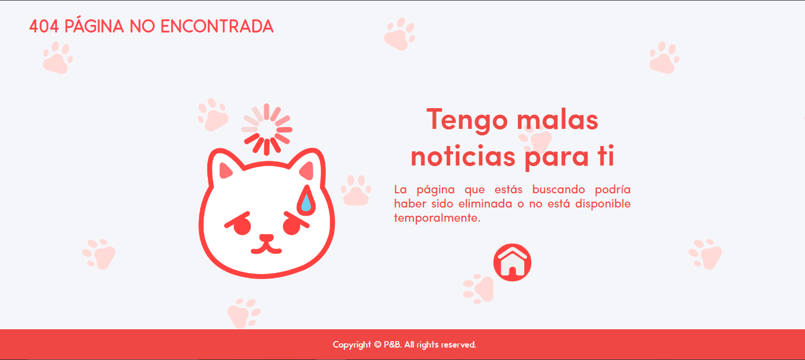

# 404 Página No Encontrada

Esta es una solución para la página de error 404 que he diseñado como parte de mi aprendizaje en desarrollo web como parte del bootcamp Make It Real 👾.

## Tabla de contenidos

- [Descripción General](#descripción-general)
  - [El desafío](#el-desafío)
  - [Captura de pantalla](#captura-de-pantalla)
- [Mi proceso](#mi-proceso)
  - [Tecnologías usadas](#tecnologías-usadas)
  - [Qué aprendí](#qué-aprendí)
  - [Desarrollo futuro](#desarrollo-futuro)
  - [Recursos útiles](#recursos-útiles)
- [Autor](#autor)
- [Agradecimientos](#agradecimientos)

## Descripción General

### El desafío

Usuarios deben poder:

- Ver un mensaje claro cuando navegan a una página no encontrada (404).
- Disfrutar de una experiencia visual agradable y animada en cualquier dispositivo gracias al diseño responsive.

### Captura de pantalla



## Mi proceso

### Tecnologías usadas

- HTML semántico
- CSS personalizado
- Flexbox
- Media Queries para responsividad
- Adobe Illustrator para la creación de las ilustraciones
- Adobe Animate para la animación del GIF
- Fuentes personalizadas: Sofia Pro y Odin Rounded
- Colores personalizados:
  - `--pinky-light`: #ffb0a9
  - `--pinky`: #ff797d
  - `--pinky-dark`: #ff585d
  - `--pinky-super-dark`: #d9534f
  - `--pinky-ultra-dark`: #c9302c
  - `--white`: #f5f6f9

### Qué aprendí

Este proyecto me permitió profundizar en las siguientes áreas:

- **Media Queries**: Mejoré mi habilidad para crear diseños responsive que se adapten a diferentes tamaños de pantalla.
- **Diseño con Adobe Illustrator y Animate**: Creé y animé los gráficos personalizados, lo que me permitió combinar ilustración con animación web.
- **Uso de fuentes personalizadas**: Implementé las fuentes Sofia Pro y Odin Rounded, aprendiendo a integrar diferentes tipografías y lograr un diseño consistente.

Aquí hay un fragmento de código CSS:

```css
@media (max-width: 768px) {
  .main-container {
    flex-direction: column;
  }
}
```

### Desarrollo futuro
Me gustaría seguir mejorando los siguientes aspectos en futuros proyectos:

- Profundizar en animaciones CSS para reducir la dependencia de herramientas externas como Adobe Animate.
- Explorar otras tipografías y cómo influyen en la experiencia de usuario.
- Implementar más interactividad para hacer la página más dinámica.

### Recursos útile
- [Guía de Media Queries](https://developer.mozilla.org/es/docs/Web/CSS/Media_Queries/Using_media_queries) - Este recurso me ayudó a perfeccionar mi uso de media queries para hacer el sitio responsive.
- [CSS Flexbox](https://css-tricks.com/snippets/css/a-guide-to-flexbox/) - Esta guía sobre Flexbox fue esencial para estructurar el layout de mi página.

## Autor
- GitHub - [NoeliaGAP](https://github.com/NoeliaGAP)
- LinkedIn - [Noelia-GAP](https://www.linkedin.com/in/noelia-gap/)
- Behance - [NoahGAP10](https://www.behance.net/NoahGAP10)

## Agradecimientos
Agradezco a ProInnóvate por la beca que me permitió fortalecer mis habilidades en desarrollo web, así como a Make It Real y a los mentores a cargo por las clases impartidas. También quiero agradecer a mis amigos y compañeros por su apoyo y feedback en la realización de este proyecto.

Asimismo, fueron de gran ayuda las guías en línea que me ayudaron a mejorar mis habilidades en animación y diseño web, así como los recursos de Adobe para la creación de las ilustraciones y animaciones.